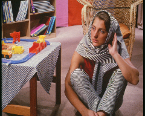

# VRDL_HW4
Code for Selected Topics in Visual Recognition using Deep Learning Homework 4

Low resolution image

Super resolution image


## Hardware
The following specs were used to create the original solution.
- Ubuntu 16.04 LTS
- Intel(R) Core(TM) i7-8700 CPU @ 3.20GHz
- NVIDIA GTX 1080ti

## Reproducing Submission
To reproduct my submission, do the following steps:
1. [Environment](#Environment)
2. [Dataset Preparation](#dataset-preparation)
3. [Training](#training)
4. [Inference](#inference)

## Environment
pytorch 1.4+


## Dataset Preparation
After downloading  images, the data directory is structured as:
```
root_dir
  +- training_hr_images
  +- testing_lr_images
  +- src
```

## Training
First, generate the training data list
```
python create_data_lists.py
```
To train models, run following commands.
```
$ python train.py
```

## Inference
If the trained weights are prepared, you can generate high-resolution images in the testing folder by the following command.
```
$ python eval.py
```

## Reference
This repository is folked from [a-PyTorch-Tutorial-to-Super-Resolution](https://github.com/sgrvinod/a-PyTorch-Tutorial-to-Super-Resolution)


